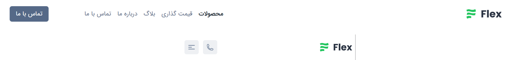
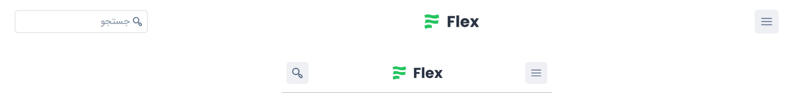

# Header List

### Header One

- *[view online (Light)](https://tailwind-parsi.github.io/flexui-components/html-css/src/navigations/header-one.html)*
  
 

- *[view online (Dark)](https://tailwind-parsi.github.io/flexui-components/html-css/src/navigations/header-one-dark.html)*
---- 

 

### Header Two

 

- *[view online (Light)](https://tailwind-parsi.github.io/flexui-components/html-css/src/navigations/header-two.html)*
  
 

- *[view online (Dark)](https://tailwind-parsi.github.io/flexui-components/html-css/src/navigations/header-two-dark.html)*
---- 

 

### Header Three

 

- *[view online (Light)](https://tailwind-parsi.github.io/flexui-components/html-css/src/navigations/header-three.html)*
  
 

- *[view online (Dark)](https://tailwind-parsi.github.io/flexui-components/html-css/src/navigations/header-three-dark.html)*
---- 

 

### Header Four

 

- *[view online (Light)](https://tailwind-parsi.github.io/flexui-components/html-css/src/navigations/header-four.html)*
  
 

- *[view online (Dark)](https://tailwind-parsi.github.io/flexui-components/html-css/src/navigations/header-four-dark.html)*
---- 